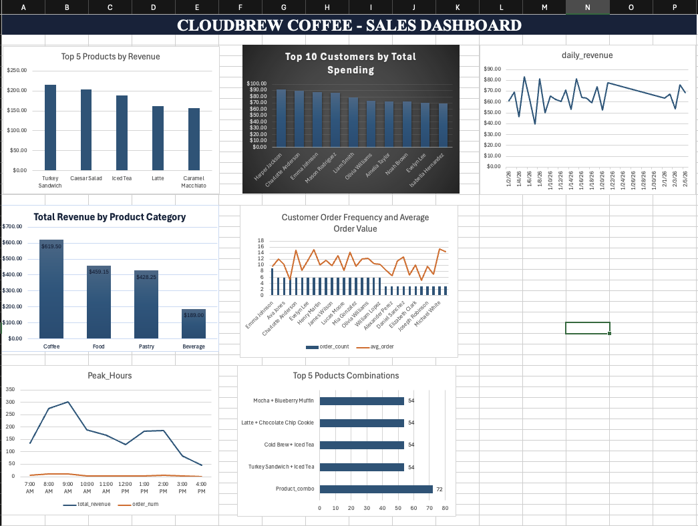

# ☕️ Cloudbrew Coffee - Sales Analysis

This is a complete SQL and Excel data analysis project analyzing coffee shop sales and data to identify revenue trends, patterns and business insights.

## Project Overview

This project demonstrates end-to-end data analysis skills including:
- Database design and normalization
- SQL Querying and data analysis
- Business insights and reporting
- Data visualization with Excel

## 🎯 Business Questions Answered

1. What are the top selling products by revenue?
   - Turkey Sandwich and Ceasar Salad generate the most revenue.

2. Who are our most valuable customers?
    - Data shows that 10 customers have fairly even spending ($23-$31 range). 

3. What are our daily revenue trends?
    - Revenue is consistent, ranging from $13-$28 daily.

4. Which product category performs best?
    - Coffee category generates the highest revenue

5. What are our peak sales hours?
    - Morning hours (8-10 AM) generates 45% of daily revenue. Peak selling hour is at 9am generating 17.7% of daily total.

6. How often do customers order?
   - Most customers order 6 times, with Emma Johnson leading at 9 orders

7. Which products are often purchased together?
    - Turkey sandwich and Iced Tea is the most popular combination (72 times).

## 📸 Dashboard Preview
    

## 🖥️ Technologies

- Database: MySQL
- Visualization: Microsoft Excel
- Version Control: Github
- SQL Concepts: JOINS, GROUP BY, Aggregations, Subqueries, Self-Joins

---

## 🔗 Connect with me:
📧 Email: Olufunbiwilliams@gmail.com  
💼 LinkedIn: [Olufunbi Williams](https://www.linkedin.com/in/olufunbi-williams-294341225/)  
🐙 GitHub: [@OlufunbiWill](https://github.com/OlufunbiWill)